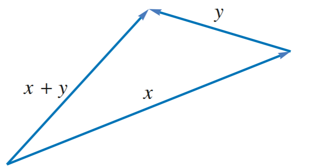

# Overview

Let's take a quick view of what we've learnt.
- function
- limits
- applications of math

Well, that's not cool enough. What I want is to give you some ideas about things below:
- 0101 in computers(How does computer work)
- Proofs sequences logic and graphs(Discrete mathematics)
- Wave-particle duality(Calculus)
- Non-negative Matrix Factorization(Linear algebra)
- Information theory(Probability)
- Blockchain(HashTree and Cryptography)
- Recommendations clustering search ranking and document filtering(Thoughts)
- Natural language understanding and Digital image processing(Combined)

First of all, you should know some "fundamental concepts".

[TOC]

## Calculus

### Functions and Limits

For Polynomials
$$
\lim_\limits {x\to a} \frac{p(x)}{q(x)}
$$

- $p(x) > q(x)$
- $p(x) < q(x)$
- $p(x) = q(x)$

How about $\lim_\limits {x\to a} \frac{0}{0}$, $\lim_\limits {x\to a} \frac{\infty}{\infty}$?

### Derivatives

#### Continuity and Differentiability

A function f is continuous at $x = a$ if $\lim_\limits {x\to a} f(x) = f(a)$

How about on an interval?

#### Intermediate Value Theorem

$a$, $b$, $c$

#### Max-Min Theorem

$a$, $b$

#### The Mean Value Theorem

$a$, $b$, $c$

#### Differentiability

speed, $v$ $x$ 

instantaneous velocity
$$
f'(x) = \lim_\limits{\Delta x\to 0}\frac{f(x + \Delta x) - f(x)}{ \Delta x} = \frac{dy}{dx}
$$

- $h(x) = f(x)g(x)$ $h'(x) = f'(x)g(x) + f(x)g'(x)$ (P112)
- $h(x) = \frac{f(x)}{g(x)}$  $h'(x) = \frac{f'(x)g(x) - f(x)g'(x)}{(g(x))^2}$
- $h(x) = f(g(x))$,  $h'(x) = f'(g(x))g'(x)$  or $\frac{dy}{dx} = \frac{dy}{du} \frac{du}{dx}$

#### L'Hopital’s Rule

- Type A: $0/0$ case
- Type A: $\infty/\infty$ case
- Type B1: ($\infty - \infty$)
- Type B2: ($0 \times \infty$)
- Type C: ($1^{\infty}$, $0^0 $, $\infty^{0}$)

Review: P303

### Integration

$\sum_\limits{i =1}^n(2i) = 2 + 4 + 6+ ...+n$

#### Telescoping series

$\sum_\limits{j = a}^b(f(j) - f(j-1)) = f(b) - f(a-1)$

=> $\sum_\limits{j=1}^n (2j-1) = n^2$ => $\sum_\limits{j=1}^n (j) = \frac{n(n+1)}{2}$

$\sum_\limits{j=1}^n (j^2) = \frac{n(n+1)(2n+1)}{6}$

#### x = vt

$\int_a^bf(x)dx = \lim_\limits{mesh\to 0}\sum_\limits{j=1}^nf(c_i)(x_j - x_{j-1})$ P330

$\int_a^bf(x)dx = F(b) - F(a)$

### Taylor Polynomials, Taylor Series, and Power Series

#### Review

## Linear algebra

### Vector

$R^2$ $R^n$

### Matrix

$A_{ij}$, $A_i$, $A_j$ $I$, $O$

$+ - \times \div$ (P74)

$A^T$, $A^{-1}$

### Determinant

......

## Probability

### Events and their probabilities

### Random variables

